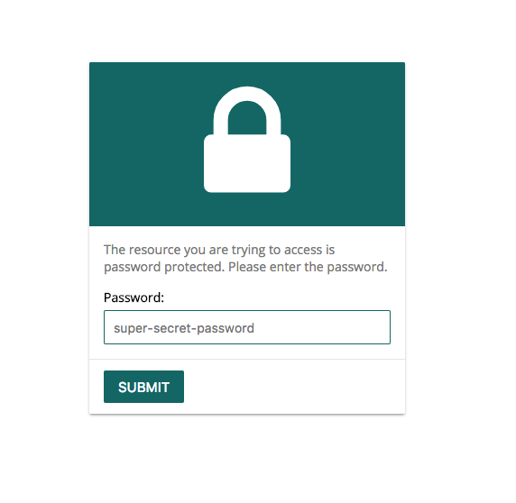

# Password protected routes

It's possible to password protect a shared link. To do so you simply set the password when building the link.

```php
ShareableLink::buildFor($model)->setPassword('super-secret-password');
```

If someone now visits the produced url they will get redirected to a password prompt



## Overriding the default view <a id="overriding"></a>

In order to override the default view you have to publish the package's vendor assets.

```bash
php artisan vendor:publish --provider="Sassnowski\LaravelShareableModel\ShareableLinkServiceProvider"
```

This will publish, among other things, the default password view to `/resources/views/vendor/shareable-model`. You can then either change the markup or replace it with a completely custom view.

